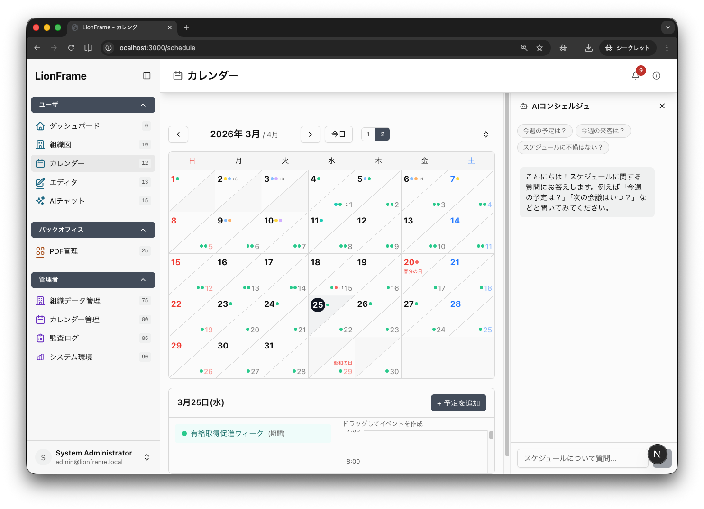

# LionFrame

組織管理システムの最小構成フレームワーク。
認証・通知・監査ログなどの基盤の上に、モジュール形式で業務機能を追加できます。



## 技術スタック

Next.js 15 (App Router) / React 19 / TypeScript / Tailwind CSS 4 / Prisma 6 (PostgreSQL) / NextAuth.js v5 / Zustand / Biome 2 / Jest 30

## クイックスタート

```bash
# 依存関係
pnpm install

# PostgreSQL 起動
docker compose up -d postgres

# 環境変数
cp .env.example .env
openssl rand -base64 48   # AUTH_SECRET を生成して .env に記入

# DB 初期化 & 起動
cd apps/web && npx prisma db push && pnpm db:seed && cd ../..
pnpm dev
```

初期ログイン: `admin@lionframe.local` / `admin` (http://localhost:3000)

## アーキテクチャ

```
フレーム基盤（認証 / 通知 / 監査ログ / i18n / Prisma）
    │
    ├── コアモジュール ─── system / ai / organization / schedule
    ├── アドオンモジュール ─ editor / forms / health-checkup / pdf / nfc-card / workflow
    └── キオスクモジュール ─ event-attendance
```

モジュールは **メニュー**（画面あり）と **サービス**（APIのみ）の2種類を持ちます。

## モジュール一覧

### コア

| モジュール | 説明 |
|-----------|------|
| system | ダッシュボード・システム環境・監査ログ・利用状況 |
| ai | AIチャット・翻訳・要約・RAG |
| organization | 組織図・社員管理・データインポート |
| schedule | カレンダー・祝日管理 |

### アドオン

| モジュール | 説明 |
|-----------|------|
| editor | マークダウン & ホワイトボード（Excalidraw）エディタ |
| forms | フォーム作成・回答収集 |
| health-checkup | 健康診断キャンペーン管理 |
| pdf | PDFテンプレート・エクスポート |
| nfc-card | NFCカード管理 |
| workflow | 申請・承認ワークフロー（サンプル） |

### キオスク

| モジュール | 説明 |
|-----------|------|
| event-attendance | NFCカードによるイベント出欠管理 |

外部 npm パッケージとしてのアドオン開発にも対応しています。

## ロール階層

```
GUEST → USER → MANAGER → EXECUTIVE → ADMIN
```

## ドキュメント

| ドキュメント | 内容 |
|-------------|------|
| [MODULE_GUIDE.md](docs/MODULE_GUIDE.md) | モジュール作成手順 |
| [ADDON_MODULE_GUIDE.md](docs/ADDON_MODULE_GUIDE.md) | アドオン追加手順 |
| [LEARNING_PATH.md](docs/LEARNING_PATH.md) | フレームワーク学習ガイド |
| [REPORT_LINE.md](docs/REPORT_LINE.md) | レポートライン（承認ルート） |

## ライセンス

MIT License - Copyright (c) 2025 MatsBACCANO
